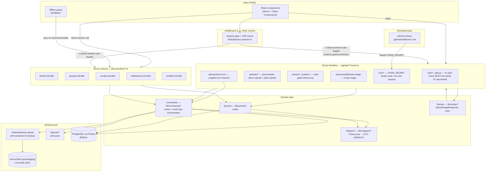
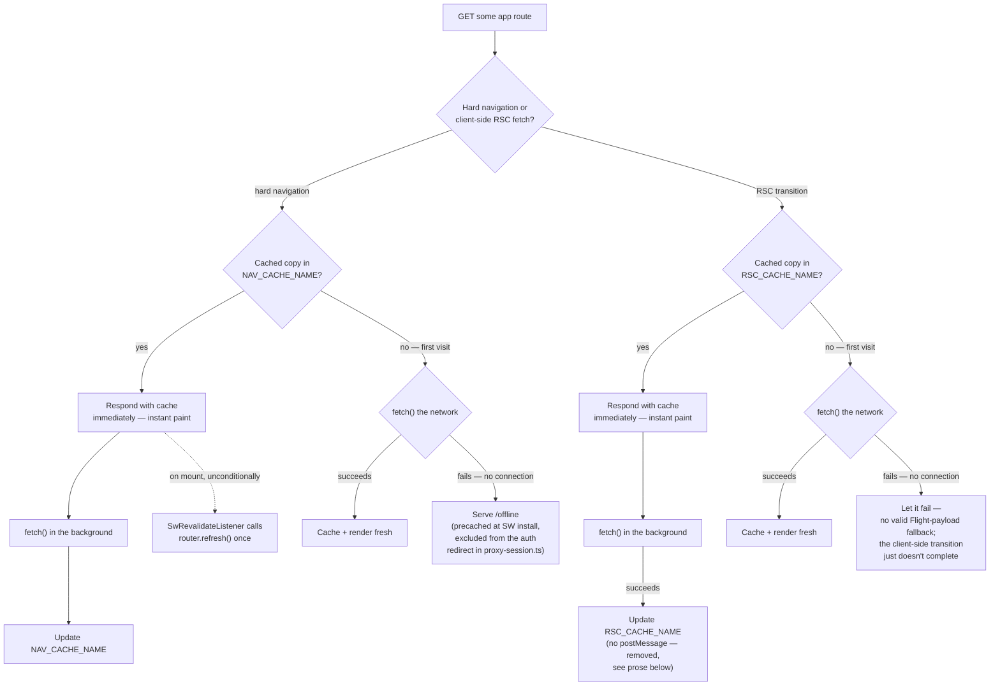
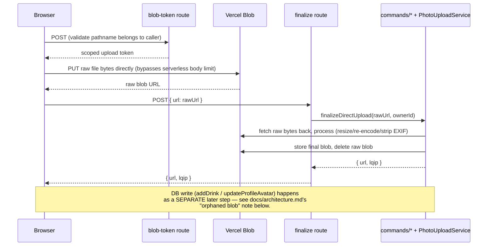

# Backend architecture

A living map of Birava's backend. **Keep this updated** whenever a new layer, route, or cross-cutting flow is added or an existing one is restructured — treat a diagram that no longer matches the code as a bug, not just stale docs.

## Layered request flow

Every request enters through either a Route Handler (`app/api/**`) or a Server Action (`lib/controllers/*.ts`, all `"use server"`), and both funnel down through the same domain layer. Neither layer talks to Prisma directly.

**Why two entry points (Routes vs. Actions) instead of one:** Server Actions are the primary path for anything a logged-in client component calls directly (mutations, most reads) — they get Next's built-in CSRF protection and don't need a hand-rolled fetch. Route Handlers exist for what Server Actions can't do: endpoints that need a specific HTTP method/response shape (image bytes, direct-upload tokens), that Content-Type: multipart/JSON bodies (photo uploads), or that are invoked by something other than this app's own client (GitHub Actions cron pings, the browser's own direct-to-Blob PUT).

## Security headers, CSP, and rate limiting

Added 2026-08-07 to close two gaps a pre-launch audit flagged and nothing had addressed since: no security headers at all, and no rate limiting on any unauthenticated endpoint.

**Headers split across two layers, deliberately.** Static, request-independent headers (`X-Content-Type-Options`, `Referrer-Policy`, `X-Frame-Options`, `Strict-Transport-Security`, `Permissions-Policy`) are set once via `next.config.ts`'s `headers()`, applied to every route including `app/api/**` and static assets. `Content-Security-Policy` can't live there because it needs a fresh nonce per request — that's set in `lib/auth/proxy-session.ts` (`lib/security/ContentSecurityPolicyBuilder.ts` builds it) on every response branch, request headers included (Next reads the nonce back off the incoming request to stamp its own inline hydration/RSC-streaming scripts — the documented Next.js pattern for CSP + nonce). Because `middleware.ts`'s matcher already excludes `api/`/static assets, CSP only ever applies to real page navigations, which is the only place it needs to.

`script-src` uses `'strict-dynamic' 'nonce-<per-request>'`, so Next's own inline scripts (and anything they dynamically inject for code-split chunks) stay trusted without `'unsafe-inline'`. `'unsafe-eval'` is added *only* when `NODE_ENV !== "production"` — Next's dev-mode Fast Refresh runtime evals code to apply hot updates; production never does this. `style-src` keeps `'unsafe-inline'` (nonces can't cover `style=""` attributes, which this app uses throughout). `img-src` allowlists `https://*.basemaps.cartocdn.com` (the session map's CARTO tiles, rendered as direct `<image>` hrefs — see `lib/mapProjection.ts`) plus `blob:`/`data:` for client-side photo previews and base64 LQIP placeholders. `connect-src` allowlists `https://nominatim.openstreetmap.org` (reverse geocoding, called directly from `log-drink-form.tsx`).

**Rate limiting is Postgres-backed (`lib/rateLimit/`), not Redis/Upstash** — this app stays on Neon/Vercel free tiers, and Postgres is already provisioned. `RateLimitBucket` (`prisma/schema.prisma`) is a fixed-window counter table, keyed by `"<scope>:<identifier>"`; `PostgresRateLimiter.consume()` is a single atomic `INSERT ... ON CONFLICT` so concurrent requests against the same key serialize on the row instead of racing on a read-then-write increment. `RateLimiterFactory.create()` hands back a shared instance; `ClientIpResolver` reads `x-forwarded-for` (Vercel sets it on every request) for the unauthenticated routes.

| Route | Key | Limit |
|---|---|---|
| `POST /api/auth/login` | `login:<ip>` | 10 / 5 min |
| `POST /api/signup` | `signup:<ip>` | 5 / hour |
| `joinGroupByInvite` (`lib/controllers/groupController.ts`) | `join-crew:<userId>` | 20 / 10 min |

`RateLimitBucket` rows are pruned by `RateLimitBucketPruner`, run daily inside the existing `prune-client-error-logs` cron (sharing its schedule rather than standing up a second one) — a row past its window has no further use since `PostgresRateLimiter` resets an expired window on its next hit regardless of whether the old row was ever deleted.

## Offline support (service worker)

`public/sw.js` maintains four caches: a static-asset cache (`_next/static`, icons, the manifest — content-hashed, safe to serve cache-first forever), a **media cache** (`/api/avatars/*`, `/api/photos/*` — also cache-first, since each is immutable at its URL per the Image pipeline section above: an edit swaps in a new one, never mutates in place), and **two page-content caches**. Missing the media cache initially was its own reported gap: avatars and check-in photos are served through auth-gated `/api/*` routes, which the nav-cache logic deliberately excludes, so without a dedicated branch for them they never got cached at all and just broke offline.

**"Page content" is two different request shapes, not one — and they need two separate caches, not just two keys in one.** A hard navigation (open the PWA fresh, reload, back/forward) requests full server-rendered HTML. Every other in-app move — clicking a `<Link>` — is client-side routing instead: Next's App Router fetches just that route's RSC (Flight) payload, marked with an `RSC: 1` header and a `_rsc=<hash>` cache-busting param, and never triggers a real browser navigation at all. Missing that distinction was the first bug caught after shipping this (only the very first hard-loaded page, typically the dashboard, was ever ending up cached). The *second* bug came from fixing the first one carelessly: an early version kept both shapes in one `NAV_CACHE_NAME` cache, distinguished only by appending a `#rsc` URL fragment to the key — but the Cache API ignores fragments entirely when matching, so the two shapes silently collided into a single entry, and a hard-navigation cache miss could return the *other* shape's raw Flight-protocol text, which the browser then rendered as if it were HTML (visible as literal `1:"$Sreact.fragment"...`-style text on screen). Fixed by giving them genuinely separate caches (`NAV_CACHE_NAME`, `RSC_CACHE_NAME`), not just separate keys in a shared one.

**Both shapes are stale-while-revalidate.** A cache hit for either shape paints instantly instead of blocking on a round trip, while the real fetch runs in the background and updates the cache for next time. `components/sw-revalidate-listener.tsx` unconditionally calls `router.refresh()` once on mount — since it lives in the root layout, which only remounts on a hard navigation (never on a client-side `<Link>` transition), this fires exactly once per app launch, reconciling a cached cold-start paint with live data shortly after (this is also why every app launch — the PWA's actual entry point — now paints instantly if it's been opened before, not just previously-visited in-app routes).

**There used to also be a second, reactive correction for RSC transitions — a `postMessage` telling any open tab still sitting on the just-revalidated route to `router.refresh()` again, so staleness (own-vs-others' accent, cheer/comment counts) self-corrected within moments instead of waiting for the next navigation. It caused a production crash and was removed (2026-08-06).** `router.refresh()` sends the exact same `RSC: 1`-headers fetch a real `<Link>` transition does — the SW has no way to tell them apart — so every refresh's own fetch always found a cache hit, whose background revalidation always fired the message, which always made the listener call `router.refresh()` again: a closed loop with no exit condition, as fast as the network round-trip allowed, easily 10+ cycles/second. Each cycle runs Next's router-sync effect once, which calls `history.replaceState()`; enough cycles inside 10 seconds tripped Safari's built-in rate limit on that API (100 calls/10s) and crashed the page with a `SecurityError` (caught via `ClientErrorLog` — see "Client-side error capture" below). Chrome/Android has no equivalent hard throttle, so the same loop just ran silently there with no visible symptom.

The first fix attempt only sent the message when the freshly-fetched body differed from what was cached — reasonable in theory, wrong in practice: fetching the exact same RSC endpoint twice in a row, zero data changes, still returns different bytes, because Next embeds a fresh random key plus a timestamp into its internal metadata/viewport streaming boundaries on *every* render, unrelated to app data. The comparison always found "different" and always sent the message anyway; it only slowed each cycle down (reading two ~80KB bodies as text per fetch) enough to drop under Safari's rate limit — no more crash, but the page kept silently re-rendering forever, which is what surfaced next. The only fix that actually terminates the loop is removing the reactive link itself: nothing listens for the revalidation message anymore, so nothing turns "a background fetch landed" into "call refresh() again," regardless of whether the content changed. The accepted tradeoff: a cold-start paint that happens to hit a stale cache entry stays stale for that page view instead of self-correcting a few moments later.

This is why a **returning, already-authenticated** user can open every page they've previously visited with no connection at all — each one plays back exactly as it last rendered, server data included, with `components/offline-banner.tsx` making clear it isn't live. A page whose *hard-navigation* shape was **never** cached falls through to `/offline`, which is why that route has to render for a logged-out request too — the middleware auth gate (`lib/auth/proxy-session.ts`) explicitly carves it out, alongside `/login`/`/signup`.

**What this does not solve:** a genuinely first-time visitor — nothing installed, nothing cached, no account yet — still needs at least one successful round trip to sign up; there's no offline-capable identity system. The offline story here is "resume where you left off with no signal," not "onboard a brand-new user with zero connectivity ever." The **check-in itself** is the one action that's fully offline-safe regardless: `lib/offline/pendingCheckins.ts` queues it in IndexedDB the instant "Log drink" is tapped, synced later by `PendingCheckinsSync` (foreground-only — WebKit has no Background Sync API).

All three content caches — nav, RSC, and media — are cleared on sign-out (the SW watches for a successful `POST /api/auth/logout`) so the next person to open the app offline on a shared device lands on the login screen, not the previous user's last-cached pages or photos.

**Last-resort fallbacks can't assume their own CSS loaded.** `/offline` and `app/global-error.tsx` both render in exactly the situations where an asset fetch just failed — so unlike every other page in this app, they use literal color values instead of `var(--token)` Tailwind classes. A `var()` reference resolves to nothing if `globals.css` itself is the thing that's missing (a real, previously-hit failure mode: the browser's own dark-mode default styling — a dark background with light default text — showing through as an unstyled, broken-looking page instead of Birava's actual, intentional dark theme).

## Client-side error capture

No error-tracking service (Sentry, Bugsnag, etc.) is wired up — `ClientErrorLog` (`prisma/schema.prisma`) plus `components/client-error-reporter.tsx` is the app's only visibility into what actually breaks for a real user. It exists because an iOS Safari-only crash surfaced in the field with no way to get a stack trace off the device (remote Safari debugging needs a Mac); it's a standing capability now, not a one-off diagnostic, and runs in both staging and production.

`ClientErrorReporter` (mounted unconditionally in `app/layout.tsx`) listens for `window.onerror` and `unhandledrejection` on every page, and POSTs whatever it catches to `app/api/debug/client-error/route.ts` → `lib/commands/clientErrorLogCommands.ts`'s `reportClientError`. That route is deliberately ungated — a crash on `/login` before any session exists is exactly the kind of thing worth seeing — so it attaches `getCurrentUser()`'s id only if one exists, rather than requiring auth.

**`public/sw.js` has its own copy of the same idea**, because errors thrown inside a service worker's scope never reach any page's `window.onerror` — it listens for `error`/`unhandledrejection` on `self` and forwards them to every open tab via `postMessage`, which `ClientErrorReporter` also listens for and reports the same way. This is why the SW's own stale-while-revalidate caching bugs are the kind of thing this system was built to catch.

`app/api/cron/prune-client-error-logs/route.ts`, scheduled daily via `.github/workflows/prune-client-error-logs.yml` (GitHub Actions, consolidated onto the same platform every other scheduled job already uses), deletes rows older than 30 days — unlike the backup retention tiers in `lib/backupRetention.ts`, there's no reason to keep an old error report once it's aged out, so this is a flat cutoff, not a tiered policy.

## Direct-to-Blob upload flow

The one flow worth its own diagram — it's non-obvious because the server is only involved at the *start* and *end*, not during the actual transfer.

**The gap this leaves, and how it's closed:** a blob can exist in storage with zero DB rows referencing it — if the form is abandoned after upload but before submit, or a tab is killed mid-flow. Closed in layers: client-side best-effort cleanup (`components/drink/log-drink-form.tsx`'s unmount/`pagehide` handlers), the offline queue persisting an uploaded URL immediately so retries don't re-upload, and a **daily reconciliation cron** (`lib/commands/photoCleanupCommands.ts`, scheduled via GitHub Actions) as the actual guarantee — it deletes anything unreferenced past a 7-day grace period, bounded to 200 delete attempts/run so a large backlog can't exceed the function's time budget.

## Scheduled jobs

Every recurring job runs the same way: a GitHub Actions workflow on a cron schedule `curl`s a `CRON_SECRET`-guarded route. Nothing uses `vercel.json`'s native cron (Vercel Hobby's once-daily limit made that a dead end for sub-daily jobs, and everything was consolidated onto one platform afterward for consistency).

| Job | Workflow | Route | Cadence |
|---|---|---|---|
| Session reminders | `session-reminders.yml` | `/api/cron/session-reminders` | every 15 min (nominal — see below) |
| Orphaned blob cleanup | `cleanup-orphaned-blobs.yml` | `/api/cron/cleanup-orphaned-blobs` | daily |
| Prune client error logs + rate-limit buckets | `prune-client-error-logs.yml` | `/api/cron/prune-client-error-logs` | daily |
| Production DB backup | `db-backup.yml` | *(none — see below)* | daily |
| Backup restore drill | `restore-drill.yml` | *(none — see below)* | monthly |

**Database backup and its restore drill are the exceptions to the route pattern above**: they run `pg_dump`/`pg_restore`/GPG/Neon-branch-management directly on the GitHub Actions runner instead of hitting a Vercel route, because a serverless function can't shell out to `pg_dump`/`pg_restore` and shouldn't be streaming a multi-minute dump through a request/response cycle anyway. See `docs/database-backups.md`.

**Session reminders got a second, opportunistic trigger (added 2026-08-08)**: GitHub Actions' `schedule` trigger doesn't reliably honor a sub-hourly cadence in practice — observed landing closer to hourly (45-90 min gaps) rather than every 15 minutes, a platform limitation, not a repo config issue. Rather than fight that, `app/(app)/layout.tsx`'s `AppHeaderLoader` (rendered on every authenticated page view) also calls `maybeSendSessionReminders()` (`lib/commands/sessionReminderCommands.ts`) via `after()`, so real app traffic — not just the external cron — can fire the check. It reuses `RateLimiterFactory`'s Postgres-backed fixed-window counter purely as a distributed "has it been 15 minutes since the last tick" debounce: whichever of potentially many concurrent requests hits it first wins the race and runs the real check; everyone else's call that window is a cheap no-op. The GitHub Actions cron stays in place as a backstop for near-zero-traffic windows (e.g. overnight) — this isn't a replacement, it's a second, more-reliable path that happens to require zero new infrastructure since it's built entirely on the rate-limiting table already added for security headers/rate limiting (see above).

## Venue extraction (complete — expand/contract migration)

`DrinkEntry.venue`/`lat`/`lng` were a 3NF violation — a venue determines its own location, but every check-in stored its own copy, and exact-string venue grouping (`Cartographer`/`Local Legend`/`Regular` achievements, `lib/sessions.ts`) silently fragmented the same real place logged with slightly different text. Fixed via expand/contract, deliberately not a single migration, given the standing "don't lose production data" constraint:

1. **Expand** — added the `Venue` model + nullable `DrinkEntry.venueId` (migration `20260805212639_add_venue_table`). Purely additive; the legacy `venue`/`lat`/`lng` columns were untouched and still populated.
2. **Transfer** — `lib/venueMatching.ts`'s `venuesMatch` (unit-tested) implements the identity heuristic: same name (trimmed, case-insensitive) and, if both sides have coordinates, within a ~100m bounding box (not true geodesic distance — deliberately simple, plenty precise at city scale); falls back to proximity-only matching when either side lacks a name (a check-in can carry coordinates with no venue typed at all — geolocation is captured independently of the venue text field in `log-drink-form.tsx`), and backfills whichever of name/coordinates a matched `Venue` was missing once better data arrives. `lib/commands/venueCommands.ts`'s `resolveVenueId` is the find-or-create wrapper around it (candidates fetched by name-match OR proximity-match, then narrowed precisely in code), used by `addDrink`/`editDrink` (`lib/commands/drinkEntryCommands.ts`) and `prisma/seed.ts` alike — the form/seed data still supplies a free-typed name + raw coordinates, resolution is always server-side.
   - **Historical data**: migration `20260805214224_backfill_venues_from_legacy_columns` — a hand-written SQL data migration (generated empty via `prisma migrate dev --create-only`, then hand-edited), not a build-time script, so it stays inside the tracked migration system (`prisma migrate deploy`, already wired into `vercel.json`) instead of a separate script needing its own build-chain wiring. It approximates the matching heuristic in SQL (name + ~111m rounded grid cell instead of `venuesMatch`'s exact pairwise check) — a deliberate simplification accepted for this one-time historical pass only; live writes use the fuller TypeScript version. It **does** resolve every row that has a name and/or coordinates (steps 5-6 handle coordinates-with-no-name via a nameless `Venue`) — see below for why that matters.
   - **Known, accepted limitation**: when a venue name matches multiple existing `Venue` rows (e.g. two real, differently-located places that happen to share a name) and the new/historical entry has no coordinates to disambiguate with, the tie-break is arbitrary (whichever candidate is returned/created first) — both the SQL migration and the live TypeScript path have this same gap. Accepted as-is: production data is a single friend group, where the same venue name existing in two genuinely different real places is expected to be rare.
   - **A real data-loss bug was found and fixed via a full-database migration rehearsal, not code review.** The dev database never had any real venue data (confirmed empty before this work started), so nothing in ordinary local testing ever exercised the backfill against a populated, realistic dataset. Before trusting this for production, the migration sequence was replayed from scratch against a throwaway database: baseline migrations applied, ~40 synthetic legacy `DrinkEntry` rows inserted covering every shape (repeat visits, near-duplicate name casing, same name at a genuinely different location, name-only, coordinates-only, neither), then the three Venue migrations run in order. First pass: the backfill's original four steps all filtered on `venue IS NOT NULL`, so coordinate-only rows (a real, reachable shape — geolocation is captured independently of the venue field) never got a `venueId`, and the next migration then dropped `lat`/`lng` — silently destroying that location data permanently. Fixed by adding steps 5-6 (claim an existing venue — named or not — at the same rounded coordinates, else create a nameless one) and moving `Venue.name`'s nullability into the *first* migration instead of the last (the fix needs to insert nameless rows partway through the sequence, before the column was otherwise made nullable). Re-ran the same rehearsal after the fix: all 40 rows with any name and/or coordinates resolved correctly, only the 2 rows with truly nothing to resolve stayed unlinked. **Lesson: an empty or near-empty dev database proves a migration runs without SQL errors, not that it's correct — rehearse destructive migrations against a realistic, synthetic-but-representative dataset before trusting them with production data.**
3. **App code** — mappers read the venue name/coordinates through the relation, so the DTO shape (`venue`/`lat`/`lng` on the app-level `DrinkEntry`) is unchanged and none of the achievement/session grouping code needed to change — it automatically stops fragmenting because the string is now always the canonical one from a single `Venue` row.
4. **Contract** (migration `20260805220646_drop_legacy_venue_columns`) — dropped `DrinkEntry.venue`/`lat`/`lng`, renamed the relation (previously `venuePlace`, to avoid colliding with the not-yet-dropped `venue` column) to the clean `venue`, and made `Venue.name` nullable to support the coordinate-only case. Every remaining query `include`/`select` was updated to fetch `venue: { name, lat, lng }` instead of the old scalar columns (`lib/queries/drinkEntryQueries.ts`, `drinkSessionQueries.ts`, `groupQueries.ts`) — this class of gap (a query site quietly missing the new `include`) is easy to miss silently, since Prisma just returns `undefined` for an un-included relation rather than erroring; the mapper then falls through to `null` and nothing looks obviously broken except the data being sparser than expected. Caught one instance via a failing integration test (`getSessionById` assembling empty venue lists) rather than by inspection — worth an explicit sweep for "is every read of this relation actually asking for it" after any similar relation-introducing change, not just trusting the type-checker (a missing `include` is not a type error, `entry.venue` is simply `undefined` at runtime when the type still claims it's present).

## Notification preferences extraction (complete — expand/contract migration)

`User.notifyCrewCheckin`/`notifyCheer`/`notifyCrewActivity`/`notifyAchievement`/`notifyFollowing`/`notifySessionReminder` mixed a settings concern (its own independent change lifecycle) into the identity table (email/password hash/etc.) — the same "wrong entity" smell as the Venue case, not a duplicated-fact 3NF violation this time. Same expand/contract discipline:

1. **Expand** — added `NotificationPreference(userId, key, enabled)` (migration `20260805230142_add_notification_preference_table`), purely additive. Sparse by design: a category defaults to enabled, so a row only exists once a user has explicitly turned it off — most users will have zero rows. `key` stays plain text matching `lib/dtos`'s existing `NOTIFICATION_PREFERENCE_KEYS` union rather than introducing a parallel enum representation of the same six strings.
2. **Transfer** — migration `20260805230159_backfill_notification_preferences_from_legacy_columns`: for each of the six legacy columns, inserts a row only where the existing value is `false` (the non-default case worth preserving) — a user who never touched settings needs zero rows after this runs. Rehearsed twice: a first pass used bare synthetic test users and was rightly called out as not properly seeded; redone by running the actual `prisma/seed.ts` demo seed to create real Demobeer/crew-mate users, setting genuinely varied legacy preferences on those real users (one override / fully opted out / untouched), then migrating — produced exactly 1/6/0 rows respectively, correctly preserved.
3. **App code** — `lib/queries/notificationQueries.ts`/`lib/commands/notificationCommands.ts`/`lib/notify.ts` all read/write `NotificationPreference` now; `NotificationPreferencesMapper.toDTO` builds the fixed six-key DTO the settings UI expects by starting all-enabled and applying whatever sparse overrides exist, so the settings page and `queueNotifications`'s push-gating didn't need to change at all beyond their data source.
4. **Contract** (migration `20260805231930_drop_legacy_notification_preference_columns`) — dropped the six `User.notify*` columns. `prisma migrate dev` refuses to run non-interactively once it detects a data-loss warning (correctly, since this genuinely drops populated columns) — generated via `prisma migrate dev --create-only` failed for the same reason, so this migration file was hand-written directly and applied via `prisma migrate deploy`, after confirming directly in the database that every real user's values were still at the default (`true`) with zero `NotificationPreference` rows lost in translation.

## Key boundaries to preserve

- **Prisma models never cross the `lib/queries` / `lib/commands` boundary un-mapped.** Every query/command returns a `lib/dtos/*` class (see `lib/mappers/*` for the conversion), not a raw Prisma row — the one intentional, documented exception is `lib/controllers/drinkController.ts`'s read functions, which still return the legacy `DrinkEntry`/`DrinkSession` shape (`lib/types.ts`/`lib/sessions.ts`) the session-grouping engine is built on.
- **DTOs are `export class X { declare field?: type }`**, not interfaces or inline types — see any file under `lib/dtos/`.
- **`modules/photo-upload/` has zero imports of anything Birava-specific** — it's a portable, constructor-injected module (interfaces, factories, C#-style OOP). App-specific composition happens in `lib/photoUpload.ts`/`lib/avatarPhoto.ts` (the composition roots), not inside the module.
- **No `any`/`unknown`/unsafe casts/non-null assertions in application code.** Where a boundary is genuinely opaque (a vendor SDK's private wire format, parsed JSON before validation), the type used is an honest one (e.g. `modules/photo-upload/Models.ts`'s `Json` type) with a runtime check or a narrowly-scoped, commented exception — never a silent `unknown`/`any`.
