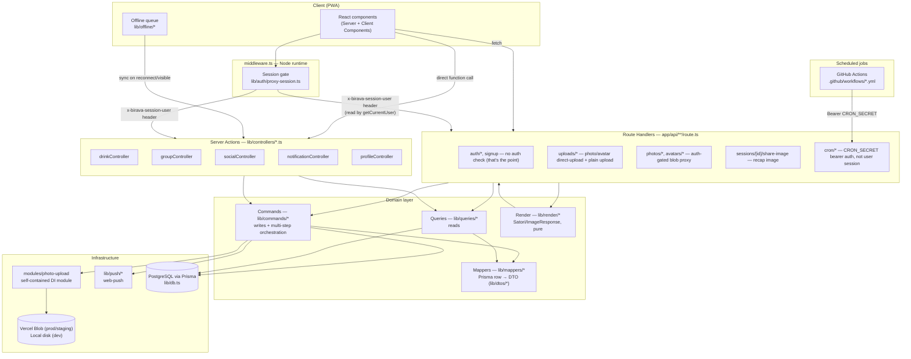
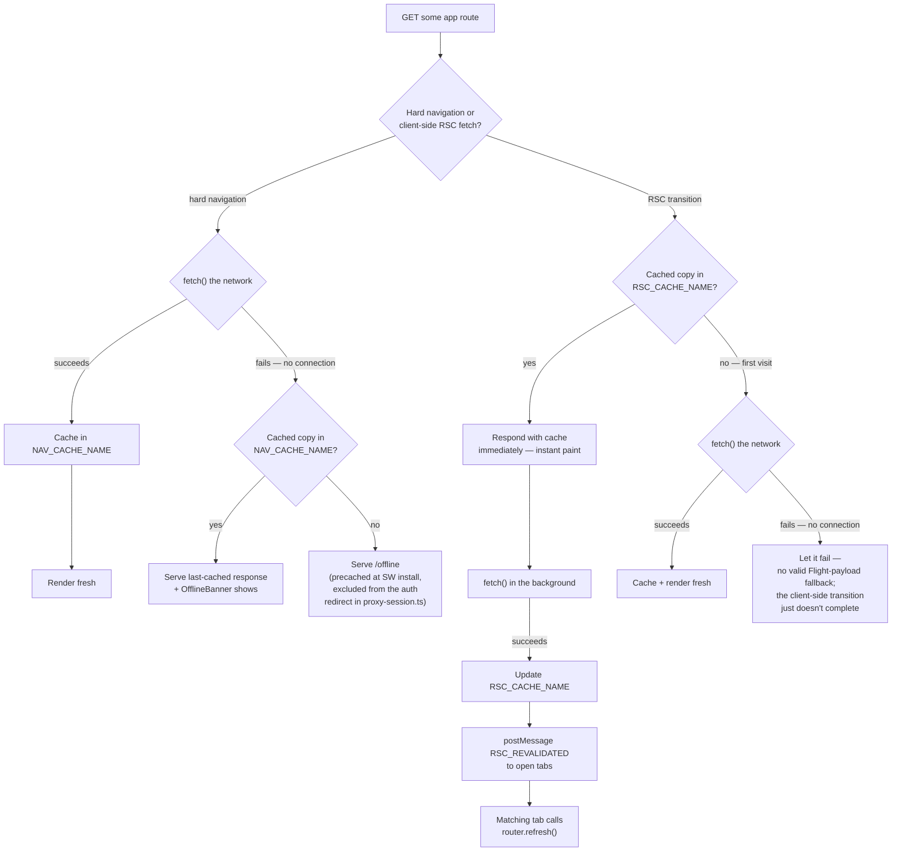
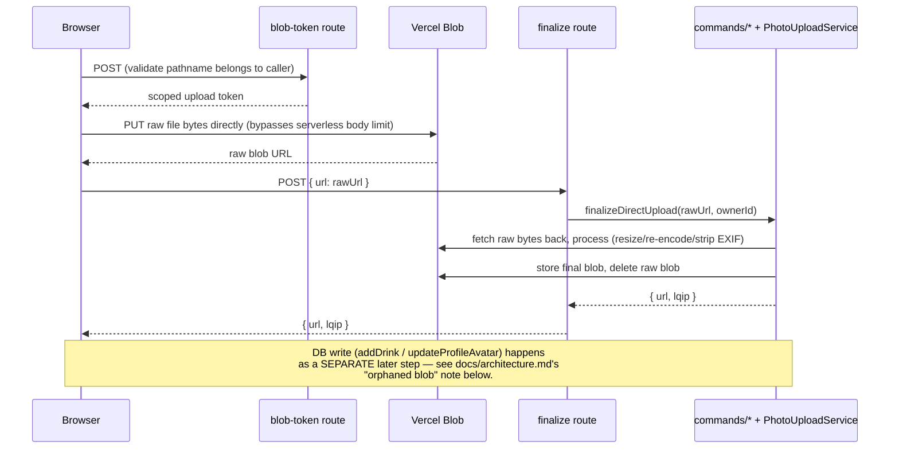

# Backend architecture

A living map of Birava's backend. **Keep this updated** whenever a new layer, route, or cross-cutting flow is added or an existing one is restructured — treat a diagram that no longer matches the code as a bug, not just stale docs.

## Layered request flow

Every request enters through either a Route Handler (`app/api/**`) or a Server Action (`lib/controllers/*.ts`, all `"use server"`), and both funnel down through the same domain layer. Neither layer talks to Prisma directly.

**Why two entry points (Routes vs. Actions) instead of one:** Server Actions are the primary path for anything a logged-in client component calls directly (mutations, most reads) — they get Next's built-in CSRF protection and don't need a hand-rolled fetch. Route Handlers exist for what Server Actions can't do: endpoints that need a specific HTTP method/response shape (image bytes, direct-upload tokens), that Content-Type: multipart/JSON bodies (photo uploads), or that are invoked by something other than this app's own client (GitHub Actions cron pings, the browser's own direct-to-Blob PUT).

## Offline support (service worker)

`public/sw.js` maintains four caches: a static-asset cache (`_next/static`, icons, the manifest — content-hashed, safe to serve cache-first forever), a **media cache** (`/api/avatars/*`, `/api/photos/*` — also cache-first, since each is immutable at its URL per the Image pipeline section above: an edit swaps in a new one, never mutates in place), and **two page-content caches**. Missing the media cache initially was its own reported gap: avatars and check-in photos are served through auth-gated `/api/*` routes, which the nav-cache logic deliberately excludes, so without a dedicated branch for them they never got cached at all and just broke offline.

**"Page content" is two different request shapes, not one — and they need two separate caches, not just two keys in one.** A hard navigation (open the PWA fresh, reload, back/forward) requests full server-rendered HTML. Every other in-app move — clicking a `<Link>` — is client-side routing instead: Next's App Router fetches just that route's RSC (Flight) payload, marked with an `RSC: 1` header and a `_rsc=<hash>` cache-busting param, and never triggers a real browser navigation at all. Missing that distinction was the first bug caught after shipping this (only the very first hard-loaded page, typically the dashboard, was ever ending up cached). The *second* bug came from fixing the first one carelessly: an early version kept both shapes in one `NAV_CACHE_NAME` cache, distinguished only by appending a `#rsc` URL fragment to the key — but the Cache API ignores fragments entirely when matching, so the two shapes silently collided into a single entry, and a hard-navigation cache miss could return the *other* shape's raw Flight-protocol text, which the browser then rendered as if it were HTML (visible as literal `1:"$Sreact.fragment"...`-style text on screen). Fixed by giving them genuinely separate caches (`NAV_CACHE_NAME`, `RSC_CACHE_NAME`), not just separate keys in a shared one.

**The two shapes also get different freshness strategies, not just different caches.** A hard navigation stays network-first — never stale while online — and only falls back to the cache when the fetch itself fails (no connection). An RSC transition (the dominant navigation mode once the app is open — almost every in-session move is a `<Link>` click) is **stale-while-revalidate** instead: a cache hit paints the destination instantly rather than blocking every click on a round trip, while the real fetch runs in the background and updates the cache for next time. The reason a hard navigation can't use the same trick: there's no way to swap a document's content after it's already rendered without a reload, so a stale hit there would have no self-correction path. An RSC transition does have one — once the background fetch lands, the SW posts an `RSC_REVALIDATED` message to any open tab; `components/sw-revalidate-listener.tsx` calls `router.refresh()` if that tab is still sitting on the exact route that just got revalidated, re-fetching the RSC payload and correcting any staleness (own-vs-others' accent, cheer/comment counts) within moments instead of leaving it until the next navigation.

This is why a **returning, already-authenticated** user can open every page they've previously visited with no connection at all — each one plays back exactly as it last rendered, server data included, with `components/offline-banner.tsx` making clear it isn't live. A page whose *hard-navigation* shape was **never** cached falls through to `/offline`, which is why that route has to render for a logged-out request too — the middleware auth gate (`lib/auth/proxy-session.ts`) explicitly carves it out, alongside `/login`/`/signup`.

**What this does not solve:** a genuinely first-time visitor — nothing installed, nothing cached, no account yet — still needs at least one successful round trip to sign up; there's no offline-capable identity system. The offline story here is "resume where you left off with no signal," not "onboard a brand-new user with zero connectivity ever." The **check-in itself** is the one action that's fully offline-safe regardless: `lib/offline/pendingCheckins.ts` queues it in IndexedDB the instant "Log drink" is tapped, synced later by `PendingCheckinsSync` (foreground-only — WebKit has no Background Sync API).

All three content caches — nav, RSC, and media — are cleared on sign-out (the SW watches for a successful `POST /api/auth/logout`) so the next person to open the app offline on a shared device lands on the login screen, not the previous user's last-cached pages or photos.

**Last-resort fallbacks can't assume their own CSS loaded.** `/offline` and `app/global-error.tsx` both render in exactly the situations where an asset fetch just failed — so unlike every other page in this app, they use literal color values instead of `var(--token)` Tailwind classes. A `var()` reference resolves to nothing if `globals.css` itself is the thing that's missing (a real, previously-hit failure mode: the browser's own dark-mode default styling — a dark background with light default text — showing through as an unstyled, broken-looking page instead of Birava's actual, intentional dark theme).

## Direct-to-Blob upload flow

The one flow worth its own diagram — it's non-obvious because the server is only involved at the *start* and *end*, not during the actual transfer.

**The gap this leaves, and how it's closed:** a blob can exist in storage with zero DB rows referencing it — if the form is abandoned after upload but before submit, or a tab is killed mid-flow. Closed in layers: client-side best-effort cleanup (`components/drink/log-drink-form.tsx`'s unmount/`pagehide` handlers), the offline queue persisting an uploaded URL immediately so retries don't re-upload, and a **daily reconciliation cron** (`lib/commands/photoCleanupCommands.ts`, scheduled via GitHub Actions) as the actual guarantee — it deletes anything unreferenced past a 7-day grace period, bounded to 200 delete attempts/run so a large backlog can't exceed the function's time budget.

## Scheduled jobs

Every recurring job runs the same way: a GitHub Actions workflow on a cron schedule `curl`s a `CRON_SECRET`-guarded route. Nothing uses `vercel.json`'s native cron (Vercel Hobby's once-daily limit made that a dead end for sub-daily jobs, and everything was consolidated onto one platform afterward for consistency).

| Job | Workflow | Route | Cadence |
|---|---|---|---|
| Session reminders | `session-reminders.yml` | `/api/cron/session-reminders` | every 15 min |
| Orphaned blob cleanup | `cleanup-orphaned-blobs.yml` | `/api/cron/cleanup-orphaned-blobs` | daily |

## Key boundaries to preserve

- **Prisma models never cross the `lib/queries` / `lib/commands` boundary un-mapped.** Every query/command returns a `lib/dtos/*` class (see `lib/mappers/*` for the conversion), not a raw Prisma row — the one intentional, documented exception is `lib/controllers/drinkController.ts`'s read functions, which still return the legacy `DrinkEntry`/`DrinkSession` shape (`lib/types.ts`/`lib/sessions.ts`) the session-grouping engine is built on.
- **DTOs are `export class X { declare field?: type }`**, not interfaces or inline types — see any file under `lib/dtos/`.
- **`modules/photo-upload/` has zero imports of anything Birava-specific** — it's a portable, constructor-injected module (interfaces, factories, C#-style OOP). App-specific composition happens in `lib/photoUpload.ts`/`lib/avatarPhoto.ts` (the composition roots), not inside the module.
- **No `any`/`unknown`/unsafe casts/non-null assertions in application code.** Where a boundary is genuinely opaque (a vendor SDK's private wire format, parsed JSON before validation), the type used is an honest one (e.g. `modules/photo-upload/Models.ts`'s `Json` type) with a runtime check or a narrowly-scoped, commented exception — never a silent `unknown`/`any`.
