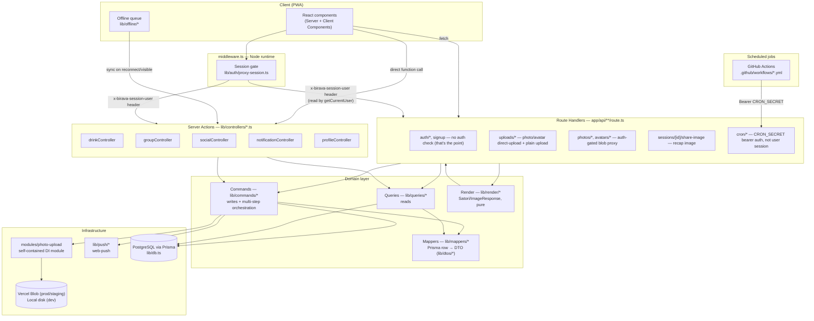
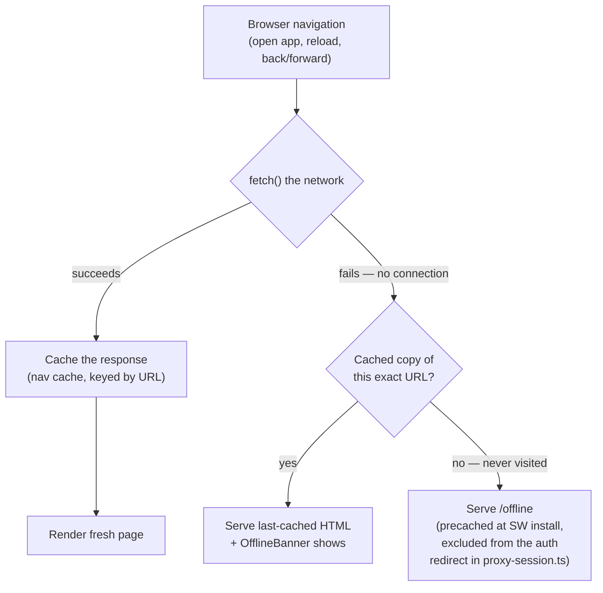
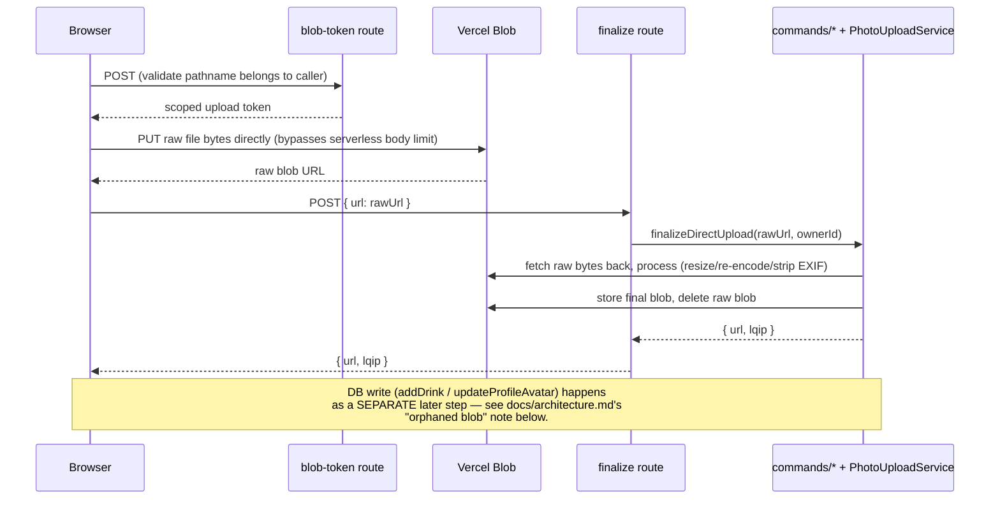

# Backend architecture

A living map of Birava's backend. **Keep this updated** whenever a new layer, route, or cross-cutting flow is added or an existing one is restructured — treat a diagram that no longer matches the code as a bug, not just stale docs.

## Layered request flow

Every request enters through either a Route Handler (`app/api/**`) or a Server Action (`lib/controllers/*.ts`, all `"use server"`), and both funnel down through the same domain layer. Neither layer talks to Prisma directly.

**Why two entry points (Routes vs. Actions) instead of one:** Server Actions are the primary path for anything a logged-in client component calls directly (mutations, most reads) — they get Next's built-in CSRF protection and don't need a hand-rolled fetch. Route Handlers exist for what Server Actions can't do: endpoints that need a specific HTTP method/response shape (image bytes, direct-upload tokens), that Content-Type: multipart/JSON bodies (photo uploads), or that are invoked by something other than this app's own client (GitHub Actions cron pings, the browser's own direct-to-Blob PUT).

## Offline support (service worker)

`public/sw.js` maintains two separate caches: a static-asset cache (`_next/static`, icons, the manifest — content-hashed, safe to serve cache-first forever) and a **navigation cache** keyed by URL, holding the last successfully-rendered HTML for each page the user has actually visited. Navigations are always network-first — a page never goes stale while online — and only fall back to the cache when the fetch itself fails (no connection).

This is why a **returning, already-authenticated** user can open every page they've previously visited with no connection at all — each one plays back exactly as it last rendered, server data included, with `components/offline-banner.tsx` making clear it isn't live. A page that was **never** opened before falls through to `/offline`, which is why that route has to render for a logged-out request too — the middleware auth gate (`lib/auth/proxy-session.ts`) explicitly carves it out, alongside `/login`/`/signup`.

**What this does not solve:** a genuinely first-time visitor — nothing installed, nothing cached, no account yet — still needs at least one successful round trip to sign up; there's no offline-capable identity system. The offline story here is "resume where you left off with no signal," not "onboard a brand-new user with zero connectivity ever." The **check-in itself** is the one action that's fully offline-safe regardless: `lib/offline/pendingCheckins.ts` queues it in IndexedDB the instant "Log drink" is tapped, synced later by `PendingCheckinsSync` (foreground-only — WebKit has no Background Sync API).

The nav cache is cleared on sign-out (the SW watches for a successful `POST /api/auth/logout` and drops it) so the next person to open the app offline on a shared device lands on the login screen, not the previous user's last-cached page.

## Direct-to-Blob upload flow

The one flow worth its own diagram — it's non-obvious because the server is only involved at the *start* and *end*, not during the actual transfer.

**The gap this leaves, and how it's closed:** a blob can exist in storage with zero DB rows referencing it — if the form is abandoned after upload but before submit, or a tab is killed mid-flow. Closed in layers: client-side best-effort cleanup (`components/drink/log-drink-form.tsx`'s unmount/`pagehide` handlers), the offline queue persisting an uploaded URL immediately so retries don't re-upload, and a **daily reconciliation cron** (`lib/commands/photoCleanupCommands.ts`, scheduled via GitHub Actions) as the actual guarantee — it deletes anything unreferenced past a 7-day grace period, bounded to 200 delete attempts/run so a large backlog can't exceed the function's time budget.

## Scheduled jobs

Every recurring job runs the same way: a GitHub Actions workflow on a cron schedule `curl`s a `CRON_SECRET`-guarded route. Nothing uses `vercel.json`'s native cron (Vercel Hobby's once-daily limit made that a dead end for sub-daily jobs, and everything was consolidated onto one platform afterward for consistency).

| Job | Workflow | Route | Cadence |
|---|---|---|---|
| Session reminders | `session-reminders.yml` | `/api/cron/session-reminders` | every 15 min |
| Orphaned blob cleanup | `cleanup-orphaned-blobs.yml` | `/api/cron/cleanup-orphaned-blobs` | daily |

## Key boundaries to preserve

- **Prisma models never cross the `lib/queries` / `lib/commands` boundary un-mapped.** Every query/command returns a `lib/dtos/*` class (see `lib/mappers/*` for the conversion), not a raw Prisma row — the one intentional, documented exception is `lib/controllers/drinkController.ts`'s read functions, which still return the legacy `DrinkEntry`/`DrinkSession` shape (`lib/types.ts`/`lib/sessions.ts`) the session-grouping engine is built on.
- **DTOs are `export class X { declare field?: type }`**, not interfaces or inline types — see any file under `lib/dtos/`.
- **`modules/photo-upload/` has zero imports of anything Birava-specific** — it's a portable, constructor-injected module (interfaces, factories, C#-style OOP). App-specific composition happens in `lib/photoUpload.ts`/`lib/avatarPhoto.ts` (the composition roots), not inside the module.
- **No `any`/`unknown`/unsafe casts/non-null assertions in application code.** Where a boundary is genuinely opaque (a vendor SDK's private wire format, parsed JSON before validation), the type used is an honest one (e.g. `modules/photo-upload/Models.ts`'s `Json` type) with a runtime check or a narrowly-scoped, commented exception — never a silent `unknown`/`any`.
